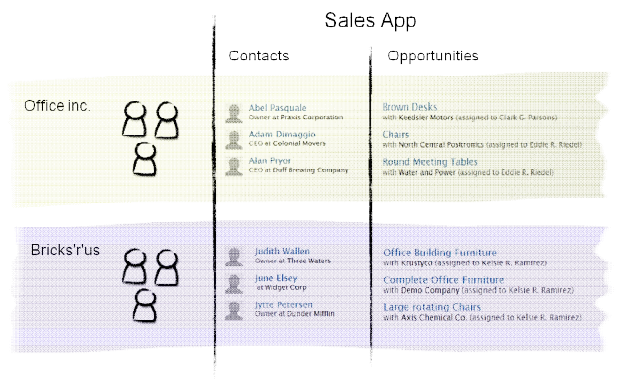
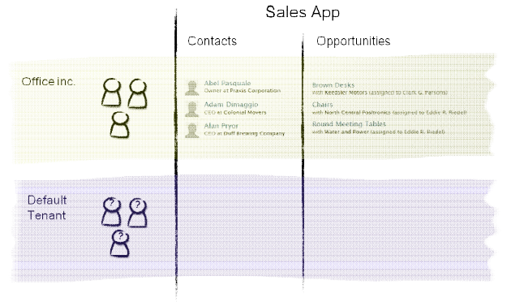
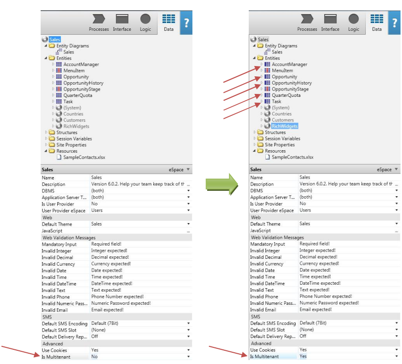
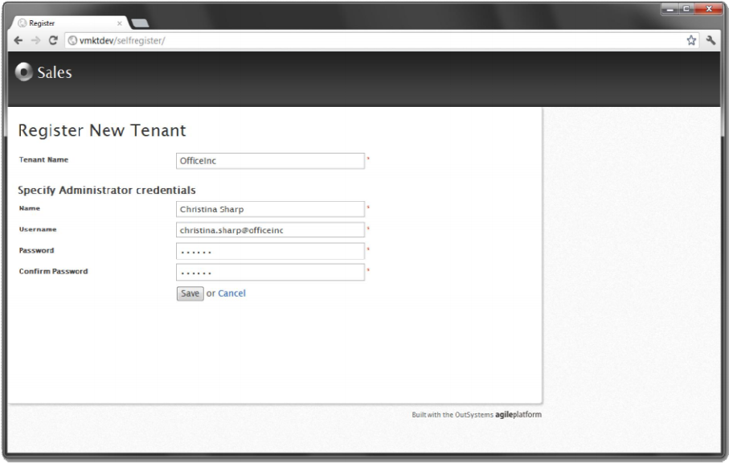
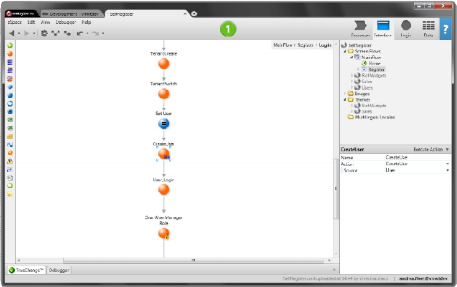
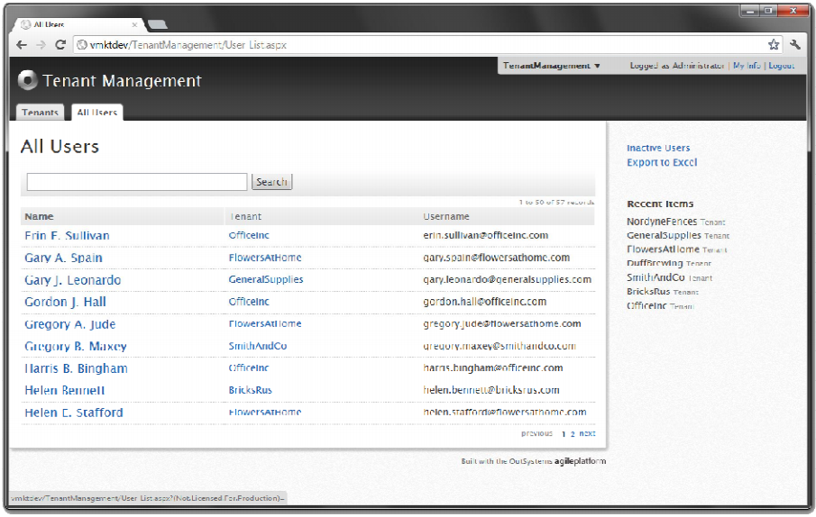
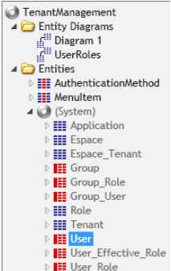
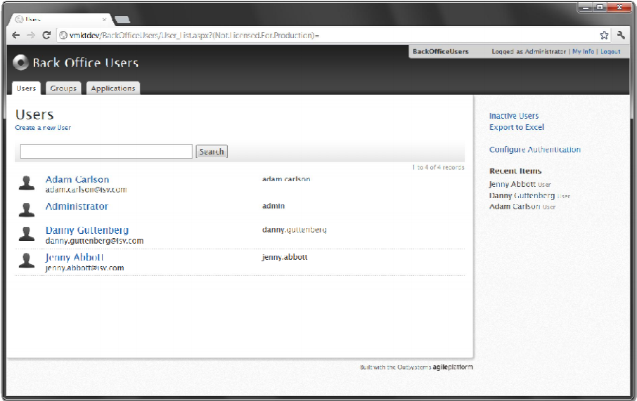

---
summary:
guid: 6e1bb224-5f33-4233-adc5-57dc98793113
locale: en-us
app_type: traditional web apps, mobile apps, reactive web apps
---

# How to Build a Multi-tenant Application

**This article applies to:**

[OutSystems 7.0 and up](https://success.outsystems.com/Support/Release_Notes/Check_what_OutSystems_version_you_are_using)

Multi-tenancy is the capability to address the needs of modern enterprise applications as well as Software as a Service (SaaS) applications to reach out to multiple customers, while enforcing an effective isolation of data, configurations, and end-users.

This approach allows a single Application Server and Database Server to provide each customer with his own isolated set of computing resources.

From the customer point of view looks like you have your own application, when in fact there is a single application that allows for some degree of customization between each customer.

The example above depicts a single application serving two client organizations (tenants) using it. Each client organization has its Contacts and Opportunities isolated in its tenant.

## Benefits of Using Multi-tenancy

Designing applications using a Multi-tenant architecture has several benefits:

* Decreases infrastructure operation costs, since there is only one application deployed in the server.

* Enforces a strict security policy for data, end-users, sessions, and processes.

* Simplifies the application development and maintenance processes, since there is a single code base to maintain.

## Multi-tenancy in OutSystems Platform 

When the end-user makes the first request to a Multi-tenant application, since he is anonymous and is not possible to infer the tenant he belongs to, the end-user is bound to a Default Tenant.

If the end-user goes to the Contacts List Screen, no contacts are shown, since the Default Tenant holds no data. 

Since an end-user uniquely belongs to a tenant, in the login process, the OutSystems Platform infers the tenant an end-user belongs using the username. Then, the end-user is bound to his tenant and all Simple and Advanced Queries are **automatically filtered **to only return data from that tenant.

**Example**: If the end-user was identified as a user of the Office inc., they are then constrained to that tenant, and the Contacts List Screen shows Abel Pasquale, Adam Dimaggio, Alan Pryor… It will not be possible for them to see information about the contacts from the Bricks’r’us tenant. 

## Tenant-Specific Elements

This section discusses how to set up the Module, Entities, Site Properties, and Timers to build a Multi-Tenant application.

Since the OutSystems Platform automatically enforces data segmentation, you just need to specify which Entities, Site Properties and Timers are isolated between clients and which are shared. You do not need to change your queries or any other business logic, since the OutSystems Platform only retrieves data for the tenant the users’ session is bound to. 

### Setting up the module

To create a Multi-tenant application, every module of the application has to be marked as Multi-tenant. This is done by simply setting its ‘Is Multi-tenant’ property of the module to ‘Yes’. This has the following effects:

* Isolates data, end-users, sessions and processes per tenant.

* Alerts other developers to the fact that the module is Multi-tenant ready.

### Setting up Entities

Check Entities of each module of your application, and decide whether they are Single-tenant (data is shared among all tenants) or Multi-tenant (data is isolated per tenant).

After setting **the module** as Multi-tenant, you should ensure that Entities, Site Properties and Timers have their ‘Is Multi-tenant’ property adequately set.

An Entity should be Single-tenant if its data is meant to be shared by all tenants and Multi-tenant if it is tenant specific.

**Example:** In an Online Shop application, Entities like Client, Product and Invoice have their data isolated per tenant, since each tenant has its own clients, products and invoices.

On the other hand, entities like CurrencyExChangeRate and Country have their data shared among all tenants, since currency exchange rates and countries are the same for all tenants.

After deciding the behavior of an Entity, set its ‘Is Multi-tenant’ property to one of the following values:

* **‘Yes’:** the Entity’s data is **isolated** per tenant regardless of the value set in the module’s Is Multi-tenant property;

* **‘No’:** the Entity’s data is **not isolated** per tenant regardless of the value set in the module’s Is Multi-tenant property;

* **< Not Defined >:** the Multi-tenant behavior of the Entity’s data is inherited from the Multi-tenant behavior of its module (the value set in the ‘Is Multi-tenant’ property of the module). Note that Static Entities are shared among all tenants. 

Note that Static Entities are shared among all tenants.

### Setting up Site Properties

Just like Entities, Site Properties allow specifying if their data is isolated or shared among tenants.

**Example:** In an Online Shop application, client organizations may be spread worldwide, therefore, each tenant should have its own setting for the default currency: the value of the 'Default Currency' site property is isolated per tenant.

On the other hand, the number of times a user can miss the password in the log-in process is the same for all client organizations: the value of the 'Number of Retries' site property is shared among tenants.

Set the ’Is Multi-tenant’ property of Site Properties to one of the following values:

* **‘Yes’:** the value of the Site Property is isolated per tenant;

* **‘No’:** if the Site Property does not isolate data by tenant;

* **< Not defined >:** the Multi-tenant behavior of the Site Property is inherited from the Multi-tenant behavior of the module.

### Setting up Timers 

Similarly to Entities and Site Properties, Timers allow specifying whether they run in the scope of a particular tenant (run once for each tenant and only manipulates data for that tenant) or run in the Default Tenant (manipulate data shared among tenants).

**Example:** In the Online Shop application, each client organization has its own clients and products, so a batch job (timer) for consolidating reporting data is isolated amongst tenants.

But since all tenants share the same currency rates, a timer to update currency rates is shared between all tenants.

Set the ‘Is Multi-tenant’ property of Timers to one of the following values:

* **‘Yes’:** the Timer is executed once for each tenant. When the timer runs on a tenant it only has access to data owned by that tenant.

* **‘No’:** if the Timer is executed once, i.e., is able to read and manipulate data shared by all tenants;

* **< Not defined >:** the Multi-tenant behavior of the Timer is inherited from the Multi-tenant behavior of the module.

## Isolating Sessions per Tenant

As discussed before, end-users belong to a single tenant. Therefore the login process of the application needs to be able to uniquely match a username to a tenant.

If you are using the default Users application to perform user management and provide a centralized login process for your applications, end-users are automatically bound to their tenant during the login process. You just need to ensure the uniqueness of usernames across tenants. This can be achieved by using **username@company** as username.

### Custom User Providers

When using a custom User Provider application, you need to identify the end-user and perform the binding to the correct tenant. There are two distinct options to this:

* **User_Login:** The User_Login action of the default Users application automatically binds an end-user to the correct tenant. If the login is successful, all queries are automatically filtered to only return data from the tenant;

* **TenantSwitch:** The TenantSwitch System Action changes the context the specified tenant.

Your customized login might let the end-user specify to which tenant they intend to access. If the end-user specifies a username, password and tenant, then you can find which user is trying to log in (even if there are two end-users with the same username in different tenants). 

## Managing Tenants and End-Users

### Front Office 

It is also possible to implement logic for self provisioning: end-users register and manage their own tenants.

In this situation, there is a front office where end-users specify the tenant name and the administration credentials. A new tenant is immediately created.

Once the end-user has a new tenant, they can perform user management but only for that tenant: they cannot manage end-users created in other tenants.

### Back Office

For managing tenants you can create a Single-Tenant back office where new tenants are created. In these situations there is a tenant manager that is able to create new tenants, and specify which end-users belong to which tenants. The tenant manager is able to manage all end-users across tenants.

Also, in the back office there has to be a Single-tenant module to create administrative users (tenant managers). 

**Warning:** When using the default "Users" application to perform user management, you cannot rename "Users" tenant for the application to operate correctly.

## Example of a Multi-tenant Application 

A [Forge component for Multi-tenant management](http://www.outsystems.com/forge/component/461/Multi+Tenant+Management/) is available.

To better illustrate how to build a Multi-tenant application, this example is based on the [Sales application ](http://www.outsystems.com/apps/sales-app/)(Single-tenant) from the OutSystems Forge.

With this example you can understand:

* How to implement data isolation;

* How to implement a front office that lets end-users self provision their own tenant, and create end-users for their tenants;

* How to implement a centralized back office to manage tenants and end-users across tenants. 

This example has the following components:

* The **TenantManagement module**: that supports the management of tenants and end-users across tenants. This back office is used by the tenant administrators;

* The **BackOfficeUsers module**: supports the management of administrative (IT) users. The end-users created in the BackOfficeUsers module, have access to the TenantManagement application for tenant provisioning and configuration;

* The **Sales solution**: a Multi-tenant application that allows end-users to self-provision and manage endusers for their own tenants. After creating the tenant, end-users for that tenant are managed using the front office Users application;

* The **Users module**: that supports the management of end-users. Since this is a Multi-tenant, once the tenant manager logs in into the Users module, he can only manage end-users from his own tenant.

### Changing the Sales Application

The following sections explain how the Sales application was modified from Single-tenant to Multi-tenant, allowing multiple client organizations to use it at the same time with data isolation.

#### Setting up the modules

To change the Sales application from Single-tenant to Multi-tenant, several modules in the Sales solution were changed to enforce data isolation.

* The ‘Is Multi-tenant’ property of the Sales, Customers, SalesSampleData, and SelfRegister modules were changed to ‘Yes’;

* The ‘Is Multi-tenant’ property of the Countries, and CustomersSampleData were not changed. 

#### Configuring Entities

Note that the Entities changed to Multi-tenant because they had no value set in their ‘Is Multi-tenant’ property, therefore they all **inherited** the setting from the module.

Once the ‘Is Multi-tenant’ property of the module is changed, you should check the Entities, Site Properties and Timers of the module to ensure they have the correct value set.

The SalesSampleData and SelfRegister modules do not have Entities, so you only need to check the Sales and Customers modules to ensure whether all its Entities require data isolation.

In the Sales module, the AccountManager, Opportunity, OpportunityHistory, QuarterQuota and Task Entities are independent from tenant to tenant so they should remain Multi-tenant.

In the Customers module, the Company, CompanyHistory, Contact, ContactHistory and ContactPicture Entities are also independent from tenant to tenant, so they should remain Multi-tenant. 

#### Configuring Site Properties

Site Properties, just like Entities, inherit the Is Multi-tenant value of the module.

This means that you should check the Sales, SalesSampleData and SelfRegister modules to validate if any Site Property needs to be changed to Multi-tenant in order to be shared among tenants.

In this example, all Site Properties should be isolated between tenants: nothing needs to be changed.

#### Configuring Timers

In this example, only the SalesSampleData module contains a Timer that creates end-users for the Sales application. Since we want the Timer to run once for each tenant, nothing needs to be changed: the Timer inherits the ‘Is Multitenant’ property from the module. 

### Implementing the Front Office

The SelfRegister module demonstrates how to implement self-provisioning of tenants in a front office. It allows end-users to provision their own tenants by specifying a tenant name and the tenant administrator credentials.

In the Login Screen of the Sales module, there is a ‘Sign up for free’ link that lets end-users provision their tenant of the Sales application, without any assistance from the administrative users. The end-user simply needs to provide a tenant name and the tenant administrator credentials

In the Save action, the fields are validated to check whether they are valid, The **TenantCreate** System Action is used to create the new tenant with the specified name, a **TenantSwitch** System Action is then used to change the context to the newly created tenant. The tenant administrator user is then created, but since the Users Entity is Multi-tenant, the new user is constrained in the OfficeInc tenant. 

### Implementing the Back Office

#### Managing Tenants and End-Users

To understand how to implement a back office where the IT team can manage tenants and users **across all tenants**, check the TenantManagement module. This is a Single-tenant module since it does not enforce data isolation

Even though end-users are isolated from tenant to tenant, the TenantManagement module implements a screen to list all end-users independently of their tenant. This is accomplished by using the ‘Show Tenant Identifier’ property.

In the TenantManagement module, take special attention to the: Group, Group_Role, Group_User, User, User_Effective_Role and User_Role Entities. These Entities are red, signaling that the ‘Show Tenant Identifier’ (found on the Advanced tab of Entities’ properties) is checked, thus the Entities explicitly **ignore tenant isolation** restrictions.

For example, since the User Entity has the ‘Show Tenant Identifier’ checked, the TenantManagement module is able to manipulate all end-users data, independently of the tenant they belong to. This property should only be used in exceptional situations, such as this one.

#### Managing IT Users 

Finally, the BackOfficeUsers is a Single-tenant module that supports IT users management. End-users created in this back office have access to the TenantManagement module. 

The IT manager can go to the BackOfficeUsers, and create a new IT user for Adam Carlson. From then on, Adam is able to access the TenantManagement application, to create new tenants and end-users that are constrained to that tenant.

