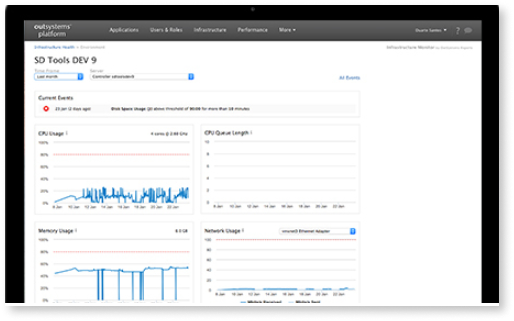

# How to create a LifeTime Plugin

Plugins are special applications that are seamlessly integrated into LifeTime:

To create a LifeTime plugin:

1. In the URL of your LifeTime environment, type **LifeTimeSDK**.

1. Follow the 'click here' link at the end of the page.

    

1. Choose your LifeTime plugin development environment

1. Install LifeTime SDK on the environment. If you have a LifeTime already installed in that environment, the LifeTime SDK installation will fail. In this case, you must [remove LifeTime from the environment](https://success.outsystems.com/Support/Enterprise_Customers/Maintenance_and_Operations/Remove_the_infrastructure_management_console_from_an_environment) before proceeding with LifeTime SDK installation, which involves deleting LifeTime's applications. Note: If you disable LifeTime's applications without deleting them, you won't be able to install LifeTime SDK.

    

1. Take this opportunity to also export sample data to your plugin development environment. This is important because all the data provided by the APIs is located in LifeTime's server, so if you call any API action from a Development server, those calls won't return any data unless, of course, you have exported it to that environment.

    

1. Now you can start the coding part. It can be done in two different ways:
    * By clicking on the **Start developing you plugin now** link:

    

    * By creating a new application in Service Studio while connected to the environment where the SDK was installed. A new template for  LifeTime plugins should now be present:
    
    

    This template already has:

    * The bootstrap action to register the plugin in LifeTime
    * The webservice to configure if the plugin is visible to the current LifeTime user
    * A UI template and styles to make your plugins look like part of LifeTime
    * All the APIs ready to use!

    

1. Check the sample plugin. In [Forge](http://www.outsystems.com/forge/) a sample plugin called [Infrastructure Monitor](https://www.outsystems.com/forge/component-overview/1178/infrastructure-monitor/) gives you an infrastructure monitoring tool for platform servers.

    

1. Plug it. Because the plugin was developed in a separate environment from LifeTime, you need to integrate it once you finish developing and testing it. For that, simply grab the solution and publish it in the LifeTime environment's Service Center.
