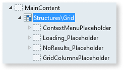

#  How to edit and save data

The following example demonstrates how to edit lines in the Grid, save the changes, and mark the lines that were edited as saved using the **MarkChangesAsSaved** action.

1. In Service Studio, in the Toolbox, search for Grid.

    The Grid widget is displayed.

    

1. From the Toolbox, drag the Grid widget into the Main Content area of your application's screen.

    

    By default, the Grid widget contains the following placeholders:

    * ContextMenu
    * Loading (displayed while data is being fetched from the server)
    * NoResults (displayed when no results are returned)
    * GridColumns

    

    You can change the content of these placeholders as required.
