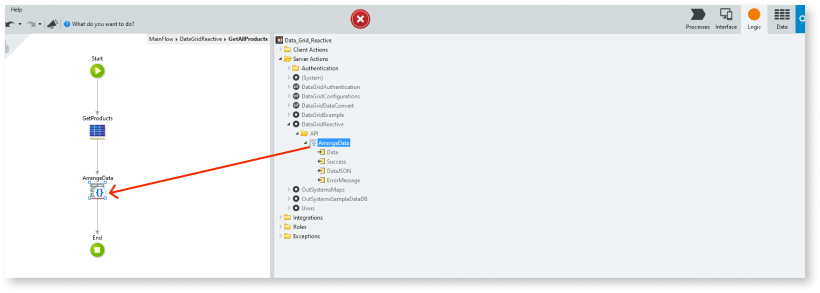
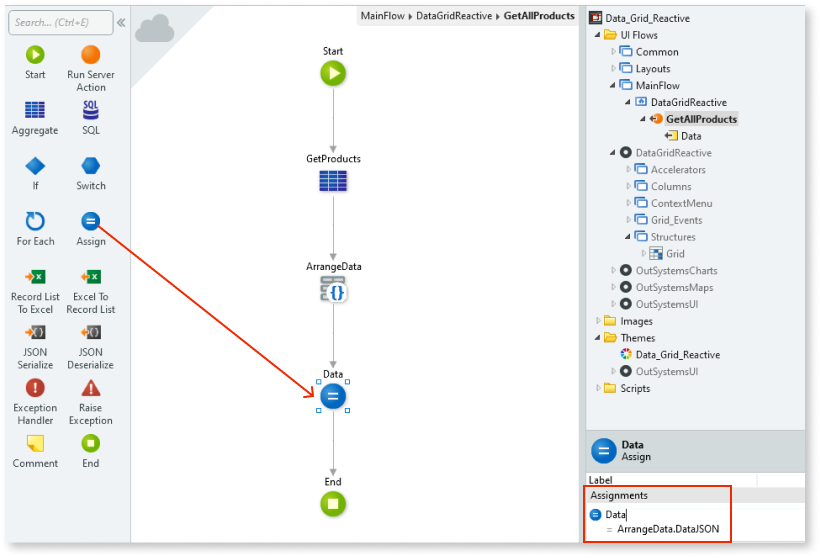
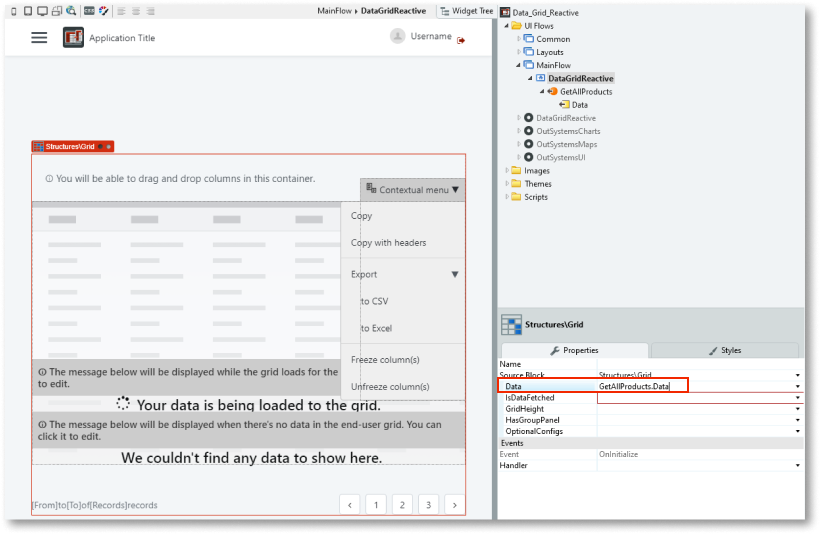

#  How to use the Data Grid component

This example fetches data from a database and displays it in the grid. (This examples does not define any column structure.) 

1. In Service Studio, in the Toolbox, search for Grid.

    The Grid widget is displayed.

    

1. From the Toolbox, drag the Grid widget into the Main Content area of your application's screen.

    

    By default, the Grid widget contains the following placeholders:

    * ContextMenu
    * Loading (displayed while data is being fetched from the server)
    * NoResults (displayed when no results are returned)
    * GridColumns

    

    You can change the content of these placeholders as required.

1. Create a Data Action to fetch the data you want to display in the grid.

    

1. Enter a name for the Action's output parameter (for example, Data) and ensure the **Data Type** is **Text**.

    This output parameter is used to receive the data fetched from the database.

    

1. On the **Data** tab, drag the data source entity onto the flow.

    

    An aggregate (in this example, GetProducts) is automatically created. 

1. On the **Logic** tab, drag the **ArrangeData** Server Action onto the flow.

    The **Grid** block receives data in JSON format. The **ArrangeData** Server Action analyzes this data, serializes it, and retrieves the information from each column, whether it be in, for example, string, number, boolean format.

    

1. Set the **Data Action** property to the aggregate result. 

    All of the aggregate data is passed to the action.

    **Note:** Because the **ArrangeData** Server Action action can receive any data structure, you must use the **ToObject** function. 

    

1. Drag an **Assign** onto the flow and set the **Data** action output parameter to the **ArrangeData.DataJSON** property.

    

1. Return to the main screen and select the Grid. On the **Properties** tab, set the **Data** property to the output of the Data Action you created earlier (step. 3).

    

1. Bind the Grid's **IsDataFetched** property to the Data Action property **IsDataFetched**.

    

After following these steps and publishing the module, you can test the component in your app.

**Result**

## Properties

| **Properties** | **Description** |
|---|---|
| InputWidgetId (Text): Mandatory  | Input element Id that triggers the element so it is visible.  |
| ButtonWidgetId (Text): Optional  |  Element name (example: button) that  triggers the element so it is visible. | 
| EventList (Date Time List): Optional  |  Receives a List of DateTime records that are used to highlight days as event days. |  
| MinDate (Date Time): Optional  |  Days before this date will be disabled. |  
| MaxDate (Date Time): Optional  |  Days after this date will be disabled.  |   
| InitialDate (Date Time): Optional |  The initially selected day for the Date Picker. If not set, it will be the current day by default.  | 
| ShowWeekNumbers (Boolean): Optional  | If True, the week number is displayed on the left side of the Date Picker. If False, the week number is not dispalyed. This is the default. |  
| FirstWeekDay (Integer): Optional  |  Defines which weekday is displayed first. <ul><li>0: Sunday</li> <li>1: Monday (default)</li><li>2: Tuesday</li> <li>3: Wednesday</li><li>4: Thursday</li><li>5: Friday</li><li>6: Saturday</li></ul> | 
| ShowTime (Boolean): Optional  | If True, a time picker is displayed below the Date Picker. If False, there is no time picker displayed. This is the default. |   
| Show24HourFormat (boolean) | If True, the time picker is displayed in a 24-hour format. This is the default. If False, the time picker is displayed in a 12-hour format. |  
| DisabledDaysList (Date Time List): Optional  |  Receives a List of DateTime records that will be disabled on the DatePicker. If this parameter is not set, all days between the MinDate and MaxDate are enabled. No default value.  |  
| DisabledWeekDays (Text): Optional  |  String containing disabled weekdays. <ul><li>0: Sunday </li><li>1: Monday </li><li>2: Tuesday </li><li>3: Wednesday </li><li>4: Thursday</li><li> 5: Friday </li><li>6: Saturday </li></ul>Example  <ul><li>_Blank_ - All weekdays are active. </li><li>_"0,5"_ - Sunday and Friday are disabled.</li></ul> | 
| SelectInterval (Boolean): Optional |  Allows the selection between two dates. If True, the Block Event "On Select" has the values for both parameters.  |   
| StartEmpty (Boolean): Optional |  Defines whether the input for the Date Picker starts as empty.   | 
| DateFormat (Text): Optional| Defaults to the date format defined in the server configuration. The default is the server date format.  Examples  <ul><li>DD/MM/YYYY - 15/05/2020 </li> <li>MM/DD/YYYY - 05/15/2020</li><li>DD MMM YYYY - 15 May 2020</li></ul> |
|ShowTodayButton (Boolean): Optional | If True, the Today button is displayed. If False, the Today Button is not displayed. This is the default. |
|AdvancedFormat (Text): Optional | Allows fors more options beyond what is provided through the inputs. |
