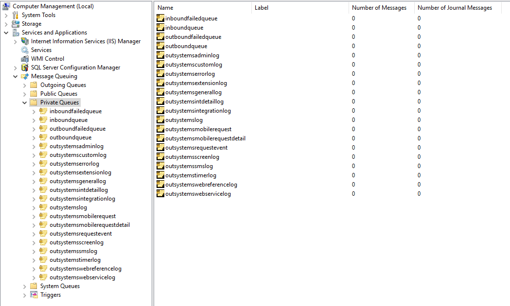

---
summary:
tags: version-11;
guid: 1635a64b-bb6b-4cb5-8a49-bcfc97929fe7
locale: en-us
app_type: traditional web apps, mobile apps, reactive web apps
---

# Log Service Cleanup

OutSystems Log Service is not used by OutSystems 11 applications.
When you upgrade an environment to Outsystems 11 the Log Service is not automatically removed since your pre-OutSystems 11 applications need this service up and running to log errors.  
After you upgrade every module of every application to OutSystems 11 the Log Service is no longer needed and you can remove it, freeing up about 30MB of memory on your server.

## Before removing the Log Service

Upgrade every single Module in every application to Outsystems 11. 
In **Computer Management** > **Services and Applications** > **Message Queuing** > **Private Queues**, make sure that the number of messages is zero (`0`) on all queues, as shown in the following image:

This ensures that there are no pending log messages from pre-OutSystems 11 Modules.

## Remove the Log Service

To remove the OutSystems Log Service and the Microsoft Message Queues managed by it, follow these steps:

In farm environments with more than one server, follow these steps for the deployment controller server and front-end servers.

1. Create a new PowerShell script file, copy and paste the following code and save it as **logserver-cleanup.ps1**:

        # Remove Log Server
        $serviceName = "OutSystems Log Service"
        if ((Get-Service "$serviceName" -ErrorAction SilentlyContinue)) {
            "Stopping '$serviceName'..."
            sc.exe stop "$serviceName" | Out-Null
            "Removing '$serviceName'..."
            sc.exe delete "$serviceName" | Out-Null
            "'$serviceName' was removed."
        } else {
            "'$serviceName' was already removed."
        }
        # Remove OutSystems MSMQ queues
        "Removing OutSystems Message Queues..."
        Get-MsmqQueue -Name "outsystems*" -QueueType Private | Remove-MsmqQueue
        "OutSystems Message Queues were removed"

1. Open a Command Prompt as administrator and run the following command, replacing `<path>` for the location where you saved the PowerShell script: 

        powershell.exe -ExecutionPolicy Bypass -File <path>\logserver-cleanup.ps1

    After the script finishes executing, open the **Computer Management** window and verify that the OutSystems Log Service is not listed as a Windows service in the **Services** and that OutSystems messages queues are not listed in the **Private Queues**.

1. Close port 12003 on your firewall. This port was previously used by the Log Service and is no longer a network requirement.
