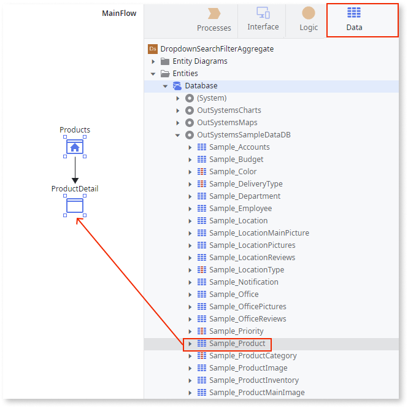

---
tags:
summary: Learn How to use the Dropdown Search to filter an aggregate with a list
guid: 46109033-C16A-4D13-B4AE-97E17F2429DF
summary: Learn how to use the Dropdown Search to filter an aggregate with a single attribute
guid: 04A17173-24A4-428C-8F0C-51281F874CAF
locale: en-us
app_type: traditional web apps, mobile apps, reactive web apps
platform-version: o11
---

# How to use the Dropdown Search to filter an aggregate with a list

The Dropdown Search is a good way to select a filter from a relatively small list. In the following example, we use it to filter a product list by multiple categories.

## Prerequisites

A reference to the **Sample_Product** and **Sample_ProductCategory** entities in the **OutSystemsSampleDataDB** module.

### Setting up the screen

1. Open the **Interface** tab and double-click your **MainFlow**.
1. Open the **Data** tab and expand the **OutSystemsSampleDataDB** module. 
1. Drag the **Sample_Product** to the **MainFlow**. 
    This creates a **Products** screen and a **ProductDetail** screen. This example focuses on the **Products** screen.

    

### Preparing the data for the Dropdown Search

1. On the **Products** screen, add a new aggregate with the **Sample_ProductCategory**.

1. Add a screen variable called **SelectedCategoryIdList** with the type **Text**. 

    This is where the multiple selected category IDs are noted in between commas, for example, ``6,14,2``.

1. On the **GetProducts** aggregate, click on the filters, and add the following filter:  

    ``SelectedCategoryIdList = "" or SelectedCategoryIdList like "%," + Sample_Product.Category + ",%"``.
    
    This filter checks each row of the aggregate if the product category ID is contained in the ID List of the variable, filtering the products per multiple categories.

### Adding the Dropdown Search

1. From the Toolbox, drag the Dropdown Search widget to the screen and on the **Properties** tab, from the **OptionsList** dropdown, select **GetProductCategories.List**.

1. In the **Mapping** section, set the **Value** to **Sample_ProductCategory.Id** and  **Label** to **Sample_ProductCategory.Label**.

1. On the **Properties** tab, expand **OptionalConfigs** and set **AllowMultipleSelection** to **True**.

1. To create a new client action for the **OnChanged** event, from the **Handler** dropdown, select  **New Client Action**.

1. Drag an **Assign** node to the action and assign the **SelectedCategoryIdList** to **" "**.

1. Drag an **If** widget to the action. 

1. Set the **False** branch to **“SelectedOptionList.Empty** and on the **True** branch, drag the **GetProducts** aggregate to the action to create a **Refresh GetProducts**. 

1. Add an **End** node.

1. Add a **For Each** node to the **False** branch and set the **Record List** property to **SelectedOptionList**.

1. Drag an **Assign** node to the **Cycle** branch of the **For Each** and assign **SelectedCategoryIdList** to expression ``SelectedCategoryIdList + "," + SelectedOptionList.Current.Value`` expression to the **SelectedCategoryIdList**.

1. Close the **For Each** node by dragging a branch from the **Assign** to it.
