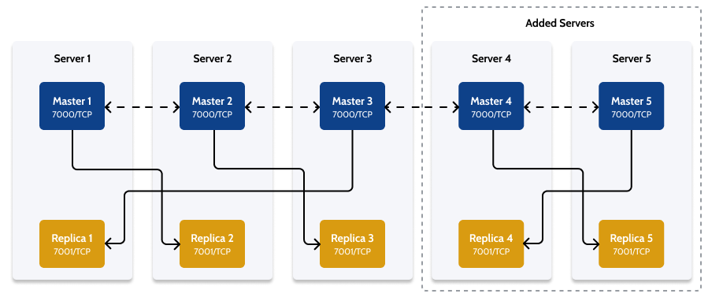

# Scale a Redis Cluster by adding more nodes { #add-node }

Applies to OutSystems self-managed infrastructures.

Note: This article builds upon the example scenario of a dedicated Redis Cluster with three servers, initially presented in [Set up a Redis Cluster for Production environments](setup-prod.md).

You can scale an existing Redis Cluster installation by adding more Redis nodes to the cluster.

Assuming that you already have a minimal infrastructure as described in [Set up a Redis Cluster for Production environments](setup-prod.md), you must **add server machines in pairs** to maintain the recommended odd number of servers. The new server machines should have same characteristics as the other Redis server machines in the cluster.

In this example, you're scaling the minimal infrastructure with an additional pair of server machines, **Server 4** and **Server 5**. Each Replica process running on these new server machines points to the Master process of the other added server, to maintain the cross-replication architecture:

* The Replica process running on Server 4 points to the Master process running on Server 5.
* The Replica process running on Server 5 points to the Master process running on Server 4.

You should configure the Master processes first, and then set up the Replica processes.

After taking the steps described in this section, the architecture of your Redis Cluster will be the following:

## Step 1. Set up new Redis processes on the new server machines

Follow the process described in [Set up a Redis Cluster for Production environments](setup-prod.md), and complete the setup of the **Master** and **Replica** processes in the new Redis nodes (up to and including [Validate the installation of the Redis servers](setup-prod.md#validate-the-installation-of-the-redis-servers)). 

Remember that you should add server machines **in pairs** to the Redis Cluster, which means that in this example you should add **Server 4** and **Server 5**, each having a Master and a Replica process.

## Step 2. Add the new Master processes to the Redis Cluster

1. Open an SSH connection to one of the new server machines - either **Server 4** or **Server 5**. The following examples assume you log into **Server 4**.

1. Run the following command to add the Master process of the current new server to the cluster:

        ubuntu@[SERVER_4]:~$ redis-cli --cluster add-node 127.0.0.1:7000 [EXISTING_CLUSTER_NODE]:7000 -a [ACCESSKEY]
   
   * Replace `[EXISTING_CLUSTER_NODE]` with a master node's hostname/IP (for example, for **Server 1**)
   * Replace `[ACCESSKEY]` with **Server 4**'s configured password

1. Repeat the same command on the other new server machine to add it to the Redis Cluster.

## Step 3. Reshard the cluster

You must perform a reshard of the cluster to redistribute the key slots evenly among all the Master processes of the Redis Cluster, including the new Master processes running on **Server 4** and **Server 5**.

1. Open an SSH connection to any of the Redis Cluster machines.

1. Run the following command:

        ubuntu@[SERVER_4]:~$ redis-cli --cluster reshard 127.0.0.1:7000 -a [ACCESSKEY]

1. Follow the prompts. You must configure:
   * How many slots to move (manually defined)
   * The receiving Master node ID
   * The source node IDs (a specific node or all nodes)

## Step 4. Add the Replica processes to the Redis Cluster

1. Copy the following command:
      
        ubuntu@[SERVER_4]:~$ redis-cli -p 7001 -a [ACCESSKEY] cluster nodes

1. Add the Replica process of the first new server (**Server 4**, running on port 7001) to the Redis Cluster by running the following command:

        ubuntu@[SERVER_4]:~$ redis-cli --cluster add-node 127.0.0.1:7001 [EXISTING_CLUSTER_NODE]:7000 --cluster-slave --cluster-master-id [MASTER_NODE_ID] -a [ACCESSKEY]

    * Replace `[ACCESSKEY]` with **Server 4**'s configured password.
    * Replace `[EXISTING_CLUSTER_NODE]` with a master node's hostname/IP (for example, for **Server 1**).
    * Replace `[MASTER_NODE_ID]` with the node ID of the Master Process on **Server 5**. 
      * A node ID is a 40-character string (for example, `ff3e4300bec02ed4bd1be9af5d83a5b44249c2b2`) as provided in the information by the command in the first step. 

1. Run the following command to setup the Replica process running on **Server 5**:

        ubuntu@[SERVER_5]:~$ redis-cli --cluster add-node 127.0.0.1:7001 [EXISTING_CLUSTER_NODE]:7000 --cluster-slave --cluster-master-id [MASTER_NODE_ID] -a [ACCESSKEY]

    * Replace `[ACCESSKEY]` with **Server 5**'s configured password. 
    * Replace `[EXISTING_CLUSTER_NODE]` with a master node's hostname/IP (for example, for **Server 1**).
    * Replace `[MASTER_NODE_ID]` with the node ID of the Master Process on **Server 4**.
      * Again, refer to the information provided in the command in the first step.

Repeat this process as necessary to scale the Redis Cluster infrastructure, adding servers and setting them up in pairs.
