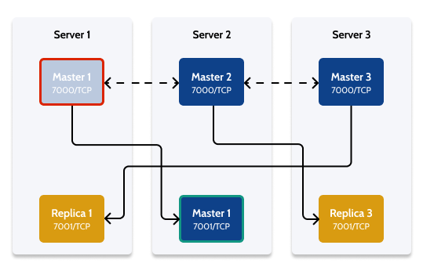

# Test the failover behavior of a Redis Cluster

Note: This article builds upon the example scenario of a dedicated Redis Cluster with three servers, initially presented in [Set up a Redis Cluster for Production environments](setup-prod.md).

You can test if the configuration of a Redis Cluster is correct by simulating a failover of a Master process (for example, the Master process on Server 1).

Do the following:

1. Open an SSH connection to one of the Redis Cluster nodes (Server 1, Server 2, or Server 3) so that you have the `redis-cli` command-line utility available.

1. Simulate a failover of the Master on Server 1 for 40 seconds by running the following command:

        redis-cli -c -h 172.31.6.35 -p 7000 -a [ACCESSKEY] DEBUG sleep 40

    You should get `OK` as the output of this command.

This command makes Master 1 unreachable by the replicas during a 40-second period, forcing the associated Replica process (port 7001) on Server 2 to take over and change its role to Master.

Reusing the same SSH connection from the previous procedure, and while the Master process in Server 1 is "off", do the following:

1. Connect to the Replica process (port 7001) on Server 2 by running the following command:

        redis-cli -c -h 172.31.11.176 -p 7001 -a [ACCESSKEY]

    Replace `[ACCESSKEY]` with the password you configured previously.

1. Run the `info` command on the `redis-cli` prompt:

        127.0.0.1:7001> info

    The output should be similar to the following:

        # Replication
        role:master
        connected_slaves:1
        slave0:ip=172.31.6.35,port=7000,state=online,offset=812,lag=1
        master_replid:32a29602c1465284658fa51966ca0ac6fda3e427
        master_replid2:f0f8124eed8297a5826d0d9c84fa67e679c67a30
        master_repl_offset:812
        second_repl_offset:813
        repl_backlog_active:1
        repl_backlog_size:1048576
        repl_backlog_first_byte_offset:1
        repl_backlog_histlen:812

        # CPU
        used_cpu_sys:0.961234
        used_cpu_user:2.659262
        used_cpu_sys_children:0.000000
        used_cpu_user_children:0.000000

        # Cluster
        cluster_enabled:1

        # Keyspace
        db0:keys=2,expires=0,avg_ttl=0
        127.0.0.1:7001>

    From the output, you can see that the Replica process running in Server 2 got promoted to Master (`role:master`).

This completes the failover test procedure for Master 1. You can repeat the same process for the other Masters, if you want.
